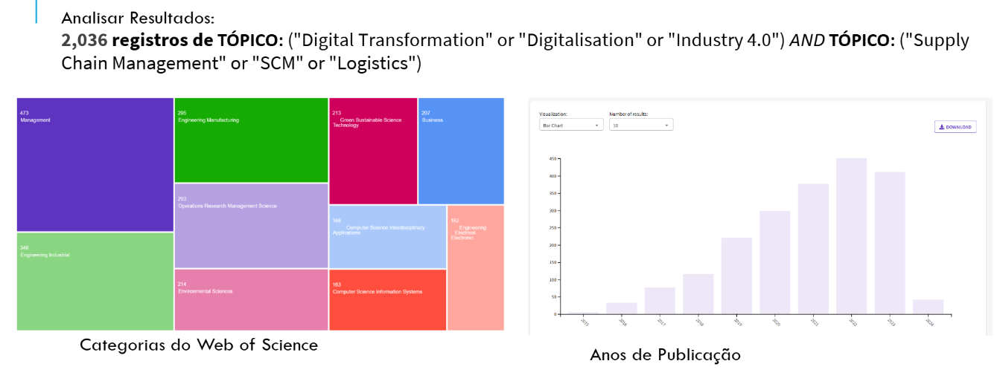
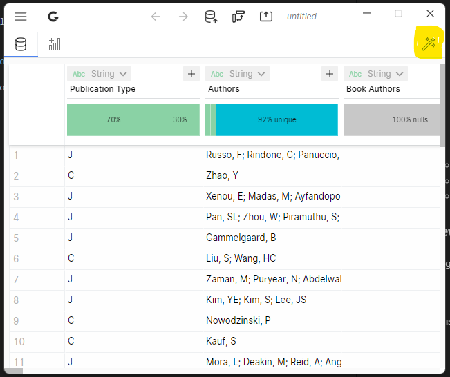
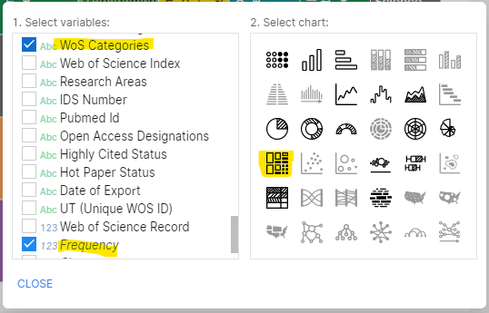
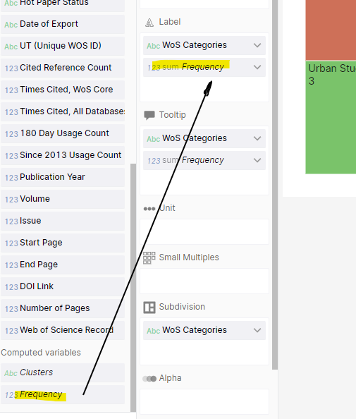
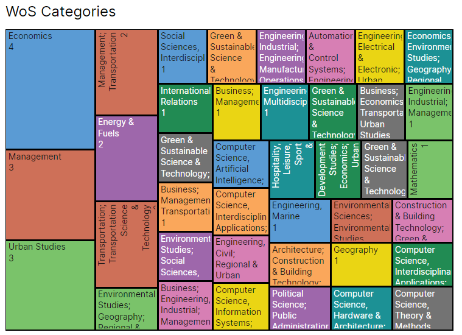
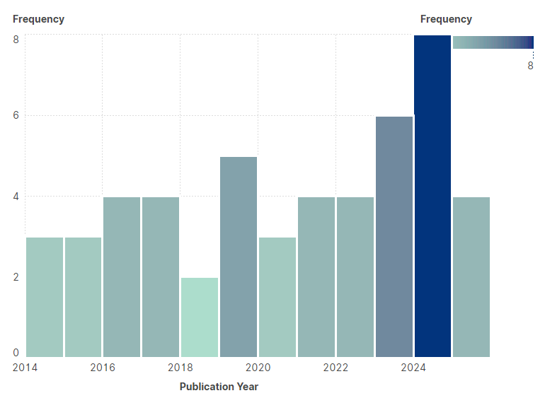

No PDF do professor temos logo no inicio uma data de gráficos deste tipo:

Descobri que é feito em um software:

## Scimago Graphica

### Utilização do sicmago:
+ Download: https://www.scimagojr.com/viztools.php
+ No WoS exportar para excel
    +  
    + Fazer "rename" do ficheiro de excel de xls para "xlsx"
    + No scimago abrir o "wizard" 
        + 
    + Selecionar "Frequency" + "WoS Category"
        + 
    + Adicionar "Frequency" às "Labels"
        + 
    + Resultado
        + 
        + 

### Ficheiro do Scimago com estes dois exemplos: "scitest.gph"

### Trabalho a fazer
Estes dois gráficos foram feitos com a query do WoS: "TS=(logistic* innovat* city)".

TS equivale a "tópic search".

Esta query devolveu 827 resultados.

Fiz apenas para os dois primeiro gráficos: "Categorias" e "ano de publicação".

Falta fazer para:

    + Tipos de documentos
    + Organizações
    + Agencias financiadoras
    + Autores
    + Títulos de fonte
    + Títulos de conferências
